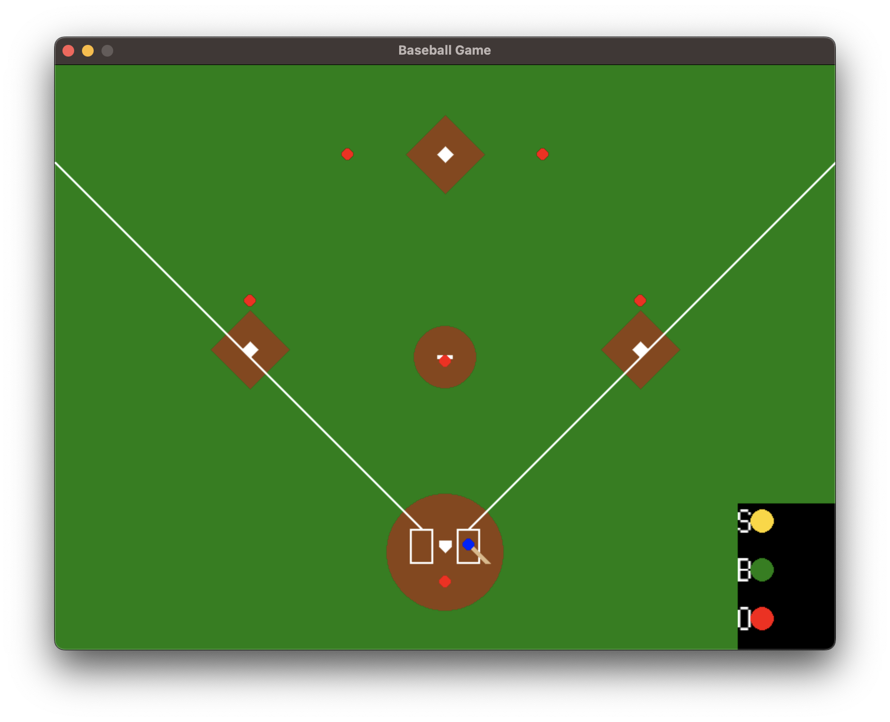

# 野球ゲーム | Baseball Game



pythonを用いて野球ゲームを実装しました．  
Github Copilotにかなり助けてもらいました．
Copilotくんは優秀ですね．

[![Python][Python.js]][Python.link]

## インストール | Installation

```console
pip install pygame
```

## 使用方法 | Usage

```console
python main.py
```

## 操作方法 | Controls

| キー | 説明 |
| --- | --- |
| w / up | 上へ移動 |
| s / down | 下へ移動 |
| a / left | 左へ移動 |
| d / right | 右へ移動 |
| N | 長押しでスイング、途中で離すことでバント |

## 使用素材 | Materials

- フォント
    - [「ノスタルドット（M+）」フォント](https://logotype.jp/nosutaru-dot.html)

<!-- MARKDOWN LINKS & IMAGES -->
[Python.js]: https://img.shields.io/badge/Python-3572A5?style=for-the-badge&logo=Python&logoColor=white
[Python.link]: https://www.python.org/